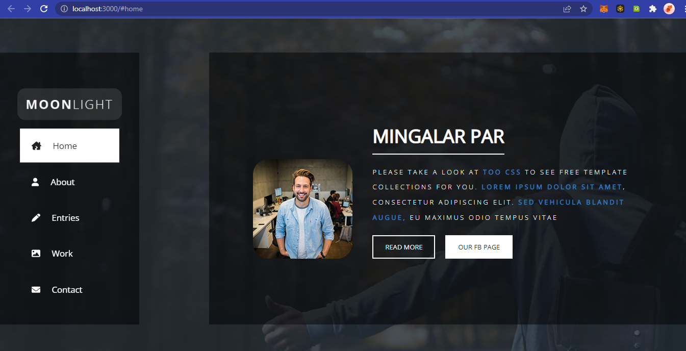

# My MoonLight Website

## Table of Contents

-   [Overview](#overview)
    -   [Project's Description](#project-description)
    -   [Screenshots](#screenshot)
-   [How to Install and Run project](#how-to-install-and-this-project)
    -   [Clone this repo](#to-clone-this-repo)
    -   [Running the application](#running-the-application)
-   [Where I be spitting lines](#where-i-be-spitting-lines)
-   [Live Version of Site](#live-version-of-site)
-   [Author](#author)
-   [Acknowledgments](#acknowledgements)
-   [Learn More](#learn-more)

## Overview

### Project's Description

This is a clone and a bit of refactoring of this [Live Demo] (https://templatemo.com/live/templatemo_512_moonlight)

### Screenshots



## How to Install and Run this project

### To clone this code

In the project directory, you can run:

### Clone this repo

Follow the steps below to clone this code

-   On your terminal, copy and paste this code ` git clone https://E-Zbox/...`
-   Once successful, run `npm install` to install necessary dependencies

### Running the application

Follow the steps below to the application running

-   Go to the director where the repo was cloned into `cd moonlight`
-   Run `npm start` on your terminal and wait a few minutes for development server to be up and running
-   Open [http://localhost:3000](http://localhost:3000) to view it in your browser

## Where I be spitting Lines

[NavbarStyles](./src/components/Styles/Navbar/index.jsx)

```js
...
const animateMenuListBefore = (bgColor) => keyframes`
    0% {
        width: 0%;
        height: 1px;
    }
    30% {
        width: 10%;
        height: 1px;
    }
...
```

[ContainerStyles](./src/components/Styles/Other/Container.jsx)
Line 100

```js
&::-webkit-scrollbar {
        width: 10px;
        &-button {
            height: 0px;
        }
        &-thumb {
            background-color: ${({
                theme: {
                    colors: { white03 },
                },
            }) => white03};
        }
        &-track {
            background-color: ${({
                theme: {
                    colors: { dark02 },
                },
            }) => dark02};
        }
    }
```

## Live version of site

> https://not-available.cos

## Author

Follow me on social media
Twitter - [@ceoCodes](https://www.twitter.com/ceocodes)

## Acknowledgments

### Cloned webpage was provided by [Templatemo](https://templatemo.com/)

## Learn More

### This project was built using `npx create-react-app`

You can learn more in the [Create React App documentation](https://facebook.github.io/create-react-app/docs/getting-started).

To learn React, check out the [React documentation](https://reactjs.org/).
